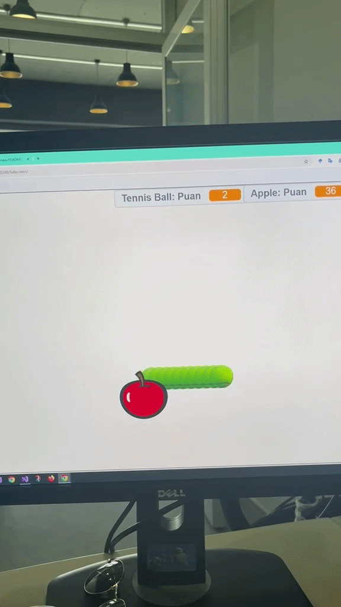

🇺🇸 English Description 

🚀 Project Goals This application teaches students the following fundamental concepts:

Algorithm: The specific sequence of steps to complete a task.

Events: Controlling how the system starts (The Green Flag).

Control Structures: Forever loops and conditional "if-then" statements.

Variables: Storing data such as "Score" and "Speed".

Robotic Sensor Logic: Detecting boundaries or self-collision (simulating physical sensors).

🎮 How to Play? Start: Click the Green Flag to begin the simulation.

Movement: Use the Arrow Keys on your keyboard to navigate the snake.

Goal: Eat the red apples to increase your score and grow longer.

Warning: The game ends if you hit the edge of the stage or collide with your own tail.

🛠️ Code Structure (Logic Flow) Movement: The snake moves 10 steps continuously. The direction is updated via arrow keys (0°, 90°, 180°, -90°).

Cloning Logic: To simulate growth, a "clone" of the snake is created at every step and deleted after a short delay.

Sensing: An if touching Apple? block triggers the apple to move to a random position and increments the score variable.

📦 Installation Download the .sb3 file from this repository.

Go to the Scratch Online Editor.

Click on File > Load from your computer and select the downloaded file.

👨‍🏫 Instructor's Note This project is designed to give children instant visual feedback and develop their debugging skills. If the snake becomes too long, try discussing with the students how to decrease the wait time. If it moves too fast, experiment with lowering the step count together.

💡 GitHub Tags #Scratch #Robotics #CodingForKids #STEM #Education #Algorithm #SnakeGame #VirtualRobotics #Debugging #EdTech #Scratch3

###############################################################################

🇹🇷 Türkçe Açıklama 

🚀 Proje Amacı Bu uygulama ile öğrencilere şu temel kavramlar öğretilmektedir:

Algoritma: Bir işi yapmak için izlenen sıra.

Olaylar: Sistemin nasıl başlayacağını kontrol etme (Yeşil Bayrak).

Kontrol Yapıları: Sürekli tekrarlar ve "Eğer ... ise" şartlı ifadeleri.

Değişkenler: Puan ve hız gibi verileri saklama.

Robotik Sensör Mantığı: Kenara veya kendine değmeyi (sensör algısı) fark etme.

🎮 Nasıl Oynanır? Başlat: Yeşil bayrağa tıklayarak oyunu başlatın.

Hareket: Klavyedeki Ok Tuşlarını kullanarak yılanı yönlendirin.

Hedef: Kırmızı elmaları yiyerek puanınızı artırın.

Dikkat: Kenara çarptığınızda veya yılan kendi gövdesine değdiğinde oyun biter.

🛠️ Kod Yapısı (Mantık Akışı) Hareket: Yılan sürekli 10 adım gider ve ok tuşlarıyla yönü (0, 90, 180, -90 derece) değiştirilir.

İkiz Mantığı: Yılanın uzaması için her adımda bir "ikiz" oluşturulur ve belirli bir süre sonra bu ikiz silinir.

Algılama: Eğer elmaya değiyor mu? ise elmayı rastgele bir konuma gönder ve puanı artır.

📦 Kurulum Bu depoda bulunan .sb3 dosyasını bilgisayarınıza indirin.

Scratch Online Editor adresine gidin.

Dosya > Bilgisayarından Yükle adımlarını izleyerek projeyi açın.

👨‍🏫 Eğitmen Notu Bu proje, çocukların kodun çıktısını anında görmeleri ve hata ayıklama (debugging) becerilerini geliştirmeleri için tasarlanmıştır. Eğer yılan çok uzun oluyorsa bekle süresini azaltmayı, çok hızlıysa adım sayısını düşürmeyi çocuklarla birlikte tartışarak deneyebilirsiniz.
